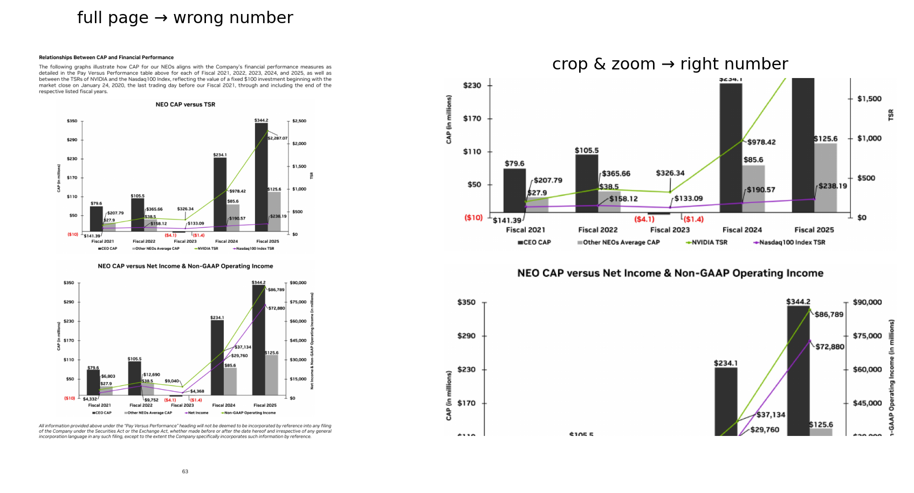
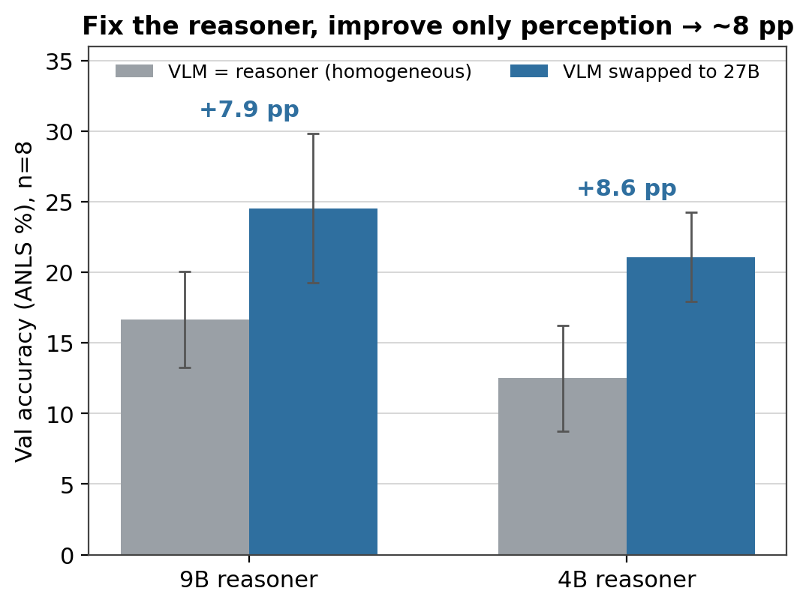

> **TL;DR**
>
> - We gave Qwen 3.5 27B a Python REPL and a single VLM
>   perception call — so it can crop, zoom, and compute over document pages instead
>   of reading them whole — and it was a joint winner of the ICDAR 2026 DocVQA
>   challenge (8–35B tier), ahead of the closed frontier on the held-out test set.
>   No fine-tuning, no document pipeline.
> - Removing one piece at a time shows **two parts carry it, together**: the REPL
>   and the perception call. Drop either and it falls to the no-scaffold baseline.
>   **Three things don't matter** — making the call a general sub-agent, the
>   trajectory format, and adding OCR.
> - It's a **perception-budget** problem, not a reasoning one. The piece is built
>   on proven ideas — Recursive Language Models, CodeAct, code-as-vision — put to
>   work on documents and taken apart to see what carries the win. Code:
>   https://github.com/bdsaglam/docvqa

## A 27B model, a Python REPL, and one question

We entered the ICDAR 2026 DocVQA challenge with Qwen 3.5 27B, an open model, and
almost no machinery around it: a Python REPL and a single call to a vision model,
used as a tool. It was a joint winner of the 8–35B tier, landing ahead of
the closed-frontier baselines — Gemini 3 Pro, GPT-5.2 — on a genuinely hard
document benchmark.

Winning is a nice anchor, but the sharper question is where the lift comes from.
That a code harness helps a model is by now well established; what's less clear is
which of its pieces — the REPL, the VLM tool, the agent loop — is actually carrying
the result. So this post takes the thing apart, one piece at a time: **which
components carry the win, and which are just along for the ride?**

The answer is useful in a specific way: the core that does the work is smaller than
what most people build. Two parts matter; the rest — a general sub-agent, clever
trajectory management, an OCR pipeline — barely move accuracy. And underneath sits
a reframe worth keeping if you build multimodal agents: on documents the bottleneck
is **perception budget, not reasoning.** The model usually isn't too weak for the
page; it just can't afford to see all of it at once.

The design builds on a few well-tested ideas — Recursive Language Models, CodeAct,
and the code-as-vision line — put to work on document QA. What this post adds is a
clean, controlled read on which of those ingredients actually matters, a mechanism
for *why*, and a competition result that shows how far it gets.

Let's start with why documents are hard.


## The task, and why it's hard

Document visual question answering is what it sounds like: you're handed a document
and a question in plain language, and you have to answer it. The catch is what
counts as a "document." In the ICDAR 2026 DocVQA challenge a single item might be a
one-page infographic or a 280-page annual report, and the answer might be a value
in a merged table cell, a label on an engineering drawing, a figure on a crowded
chart, a date in a form, or something you only get by reading two pages and doing
arithmetic.

So before any reasoning happens, there's a finding problem: locate the right page,
then the right region on it, *then* read — often compositing or computing over what
you found. That's the part general-purpose vision-language models struggle with.
Hand a VLM all the pages at once and it reads each at a fixed resolution with a
fixed slice of attention. On a sparse page that's fine. On a dense one it isn't.

Here's a concrete one. This is a chart from a financial report; the question asks
for a value on it.



**Figure 1.** Left, the full page: two bar-and-line charts with around twenty tiny,
overlapping data labels. Right, a crop of the band that holds the answer. Read the
whole page in one pass and the model returns the wrong number — it grabs a
neighboring label. Crop to the region and zoom, and the right value is legible.
The information was always there; the model just couldn't afford to resolve it in
a single look.

That gap — between what's on the page and what a single read can resolve — is the
whole game. The question is what to do about it. The obvious moves are to use a
bigger model or to stuff more pages into the context window. The move that actually
worked was to let the model decide *where to look*.


## The recipe

The whole method fits in one sentence. Give a code-capable model a persistent
Python REPL and a single perception primitive — an on-demand call to a VLM,
pointed at any region of any page — and let it *direct* perception instead of
swallowing the document whole. It can crop to the evidence, zoom for acuity, sweep
pages in a loop, composite regions, and do in code the coordinate math and
arithmetic a VLM is bad at. Perception becomes something the model spends
deliberately, a region at a time, rather than a single fixed gulp of pixels. Three
moves give the system its name — **Perceive-Reason-Code**: perceive through a VLM
call, reason in language, act by writing code.


**Figure 2.** Left: the active-perception loop — the reasoner writes code, the
code calls a (frozen) VLM against a chosen crop, the text it returns flows back
into the REPL as the next observation. Right: a ReAct agent with the same VLM but
no REPL — it can call the tool, but only on whole pages, with no way to crop,
compose, or compute. The REPL is the only structural difference between them, and
it's what converts reasoning into targeted perception.

Concretely, the loop is the familiar agent shape: a **state** (the transcript so
far), an **action** (a block of Python the model writes), and an **observation**
(whatever that code prints — including the text a perception call returns). Hold
onto that framing; how the state is represented turns out to matter later, in a
way that doesn't affect accuracy at all.

Here's a representative trajectory, lightly trimmed. The question asks for the gap
between two figures on the dense financial chart from Figure 1 — buried deep in a
181-page report.

```python
# survey the document, find the page with the relevant chart
pages = search_pages("total shareholder return")        # -> page 76
look(page=76)
# VLM (whole page): "NVIDIA TSR is $978.42; Nasdaq-100 TSR is $190.57"
```

The numbers look off — the labels are tiny and overlapping, and a whole-page read
is exactly where a VLM misreads. So the agent distrusts itself and crops in:

```python
crop = region(page=76, box=(0.55, 0.18, 0.95, 0.42))    # the top chart band
look(crop, zoom=2)
# VLM (cropped): "NVIDIA TSR $2,287.07; Nasdaq-100 Index TSR $238.19"
answer = 2287.07 - 238.19
submit(round(answer, 2))                                # -> 2048.88  ✓
```

The crop-and-verify catches a wrong number a single read would have submitted, and
the subtraction happens in Python where it's exact. Survey, locate, read, distrust,
re-read at the right scale, compute — every move that makes the method work shows
up in one short trace.

One setup detail, since a careful reader will ask: these runs disable the model's
native "thinking" channel.[^think] That doesn't make the agent reason less — it
relocates the reasoning into the visible body of each turn, where the code and the
comments are. Thinking-off is not answering-without-reasoning; it just moves the
reasoning somewhere we can see it.

### Where this comes from

Perceive-Reason-Code stands on a few well-tested ideas. The REPL-with-a-sub-call
shape comes from **Recursive Language Models** (Zhang et al., 2025): the model works
inside a code environment where the document is just a variable it can slice and
inspect with code, and it can fire off a sub-call to a model when it needs one.
Writing actions *as code* rather than as JSON tool calls is **CodeAct**.
Orchestrating vision modules with a program goes back to **VisProg** and
**ViperGPT**. The move here is to put them together for documents, with the sub-call
specialized as visual perception. (When the same model serves as both reasoner and
VLM, that perception call is the model calling itself — but nothing here turns on
that; it's a single call used as a perception tool, and that's how we'll treat it.)

RLM had already shown, for *text*, that the REPL alone lifts a baseline and a
sub-call lifts it further. The question this post answers is whether that holds when
the sub-call is a *VLM* over a stack of document images — and, more usefully, which
piece is actually responsible. The rest of the post is the controlled answer.

[^think]: We run with `enable_thinking=false` for cost and reproducibility.
Re-enabling it doesn't change the picture (a separate ablation moves it less than
the trial-to-trial noise).


## What's actually carrying the lift

The harness has a few moving parts: a Python REPL, a VLM that the agent calls as a
perception tool, and the loop that ties them together. Which of those is doing the
work? The clean way to find out is to remove one part at a time and watch the
score move. Every run below is the same model (Qwen 3.5 27B as both reasoner and
VLM), on the same DocVQA-2026 validation set (25 documents, 80 questions), with the
same answer-formatting rules — eight trials each, scored by ANLS, the fuzzy
string-match metric DocVQA uses, and reported as mean ± standard deviation. Only the
structure changes.

Start at the top and take away the REPL. What's left is a **ReAct agent**: the
same VLM perception tool, but called through plain tool-use instead of from inside
a code environment. The score falls from **41.9%** to **27.2%** — about fifteen
points. Without a REPL the agent can't crop a region by arithmetic, can't tile a
page, can't subtract two numbers it just read; it asks for whole pages and stops
early (around five steps per question). The REPL isn't a convenience. It's the
thing that lets reasoning turn into *targeted* perception.

Now do the opposite: keep the REPL, take away the perception *call*. Give the
agent a `display()` that loads the page pixels straight into its own context, so
it looks at the document itself instead of asking a focused VLM call to look and
report back. This collapses too — down to **22.3%**. The agent also thrashes: it
runs 30+ steps per question and pins the iteration cap on most of them, grinding
without converging.

That second result is exactly what the Recursive Language Models line would
predict. Stuffing raw content into the reasoner's own context degrades it — the
familiar context-rot effect, where a model handles a long or noisy context worse
than a clean one — whereas a focused sub-call that returns *compact text* keeps the
context clean. RLM tells this story for long text; here it shows up for pixels — and
it's what pins down *which* half does the work. Having a REPL isn't enough on its
own; the perception has to go through **a call that returns text**,
not be poured into the reasoner's own window. (The RL-trained version of "let the
model look at its own image crops" is DeepEyes;[^deepeyes] the point here is only
that a *prompted* REPL agent is better off not.)

Put the two knockouts together and you get a clean 2×2:

| | **with active-perception call** | **without (pixels in-context / none)** |
|---|---|---|
| **with REPL** | **41.9%** (full method) | 22.3% (`display()` only) |
| **without REPL** | 27.2% (ReAct) | 20.9% (raw multi-image, no scaffold) |

You need both halves; neither alone gets you far. Drop either and you
land in the low-to-mid 20s, near the no-scaffold baseline. The lift lives in the
combination: a code REPL **and** a single call to a VLM used as a perception tool.


**Figure 3.** The full configuration space, eight trials each. Three tiers
separate cleanly: REPL + active perception (~36–42%), missing one of the two
(no REPL, or no perception call — 21–27%), and an OCR-only floor (next section).
Every cross-tier gap is much larger than the per-cell spread.

### Three things that turn out *not* to matter

The core is small, and the obvious ways to enrich it don't make it any bigger —
which is the more useful half of the story, because it's what tells you what you
*don't* need to build.

**Generalizing the call buys nothing.** We replaced the focused "look at this
region" call with a general sub-agent that could take on any subtask (image
optional). Accuracy didn't move — **36.7%**, inside the noise of the full method.
And when we logged what the agent actually asked the sub-call to do, about **99%**
of the calls were still plain perception. One focused perception primitive already captures the
benefit; the extra generality just sits there. (We use a single call throughout; we
never tried stacking them deeper.)

**The trajectory format doesn't matter — for inference.** Our agent compacts its
history as it goes (the RLM style). Its twin keeps an **append-only** transcript
instead, never compacting — the CodeAct style, a fully-observable log of every
turn. The two tie: **39.5%** vs 41.9%, within a couple of points, and the
append-only version doesn't even lose ground on longer documents (the per-document
gap is uncorrelated with page count). For getting the answer, how you represent
the trajectory is a wash.

It does, though, matter for something else — **training**. If you ever want to
*train* the agent (with reinforcement learning, or by distilling a stronger one),
the methods assume the model's output grows as a clean prefix — turn *t* is just
turn *t−1* with more appended. Compaction breaks that: it rewrites the history
between turns, so the sequence is no longer a growing prefix. The append-only
transcript keeps it, which makes it the more *trainable* of the two — and, as we
just saw, choosing it costs nothing in accuracy. (Making compacted trajectories
trainable anyway is its own open problem; FoldAct is an early attempt.[^foldact])
We'll come back to this at the end.

**Adding OCR on top buys nothing here.** Bolt OCR page text and a BM25 search tool
onto the full method and the score is **36.6%** — flat, within the noise. On these
moderate-length documents, text retrieval adds nothing the active-perception call
isn't already getting from the pixels.

So the core that matters is small: **a REPL plus one active-perception call.**
Generality, trajectory format, and OCR-on-top are all dispensable. If you were
going to build this, you'd build less than you think.

That leaves one more knockout — the one that says what kind of problem this is.

[^deepeyes]: Zheng et al., *DeepEyes: Incentivizing "Thinking with Images" via
Reinforcement Learning*, arXiv:2505.14362.

[^foldact]: Shao et al., *FoldAct: Efficient and Stable Context Folding for
Long-Horizon Search Agents*, arXiv:2512.22733.


## Why it works: a perception budget, not a reasoning one

Here's the knockout that says what kind of problem this is. Take the exact same
REPL agent and swap its eyes for a text channel: instead of an active-perception
call, give it the OCR transcript of every page plus a search tool, and **no vision
at all.** Same scaffold, same reasoner, same loop — only the perception modality
changes.

It falls to **14.7%**, the lowest score in the whole study, below even the
no-scaffold competition prompt. On the categories where the answer lives in the
layout rather than the text — engineering drawings, maps — it scores **zero out of
ten in all eight trials.** For these layout-bound questions, on this model, OCR text
can't stand in for looking. Whatever the scaffold is buying, it is buying
*perception*, and the bottleneck it relieves is a visual one.

That reframes the whole result. Qwen 3.5 27B is not short on reasoning — give it the
right view of the evidence and it answers fine. What it
can't do is *afford* the right view in one shot. A document page can carry far
more fine-grained visual information than a single VLM read can resolve: twenty
overlapping labels on a chart, a value in a merged table cell, a dimension on a
drawing. A whole-page read spends a fixed perception budget badly. Active
perception rations that budget — crop to the evidence, zoom for acuity, read the
small thing at the scale it needs.

If that's the real story, the advantage should be largest where a page packs the
most fine detail. It broadly is. The per-category gap between the active-perception
agent and the ReAct baseline tracks visual density:


**Figure 4.** The active-perception advantage over ReAct, by document category
(Qwen 3.5 27B, eight trials). Biggest on dense, structured pages where cropping
recovers fine detail — engineering drawings (+36), business reports (+30),
infographics (+19) — and smallest on text-linear pages like science papers (+4) and
slides (+1), where a single read already gets most of the page. (Maps are a hard
case for every configuration, so the *advantage* there is modest even though the
pages are busy.) The ranking is the point, not the exact values.

### It's perception, not reasoning

The cleanest test holds the reasoner fixed and changes only the eyes. Take a
smaller model as the reasoner and feed its perception calls to progressively
better VLMs, ending at the 27B. The reasoner never changes; only the quality of
what it can see does. Accuracy climbs about **eight points** at both sizes we
tried — +7.9 with a 9B reasoner, +8.6 with a 4B one, both well outside the
noise.[^stats] Same brain, better eyes, large lift: that's the signature of a
perception bottleneck, not a reasoning one. (And it cuts the other way too: a
stronger reasoner writes better-targeted perception queries and gets more out of
even a weak VLM. ReAct has no such actuator — its ceiling is whatever a whole-page
read resolves, and a smarter reasoner can't aim it.)



**Figure 5.** Hold the reasoner fixed and swap in a stronger (27B) perception
backend, and accuracy jumps about eight points at both reasoner sizes. Same brain,
better eyes — the signature of a perception bottleneck.

The lift is a **capacity gate**, though, not a free lunch — the model has to be a
good enough coder to drive the REPL at all. You can watch the gate switch on and off
inside a single model family: a 31B Gemma clears its ReAct baseline by fourteen
points, but a 4B Gemma collapses — every configuration lands in the same low single
digits, the model too weak to write the code, so the scaffold has nothing to stand
on. The same gate shows up in Qwen: holding perception fixed at the 27B backend and
varying only the reasoner, the active-perception agent beats ReAct at every size we
tried (27B 42 vs 27, 9B 25 vs 21, 4B 21 vs 16), and the margin is widest for the
strongest reasoner. The harness amplifies a capable model; it can't rescue one that
can't code.

None of this is special to Qwen 3.5 27B. The lift shows up across Qwen sizes and in
a second family (Gemma), for any model that's a strong enough multimodal,
code-writing reasoner — Qwen 3.5 27B is simply the one we entered in the challenge.
The recipe is about the harness, not the checkpoint.

A note on what this is *not*. We did find a length effect across *benchmarks* —
on much longer documents, a fixed-page baseline starts answering "unknown" as the
evidence falls off the end of its budget, while the active-perception agent stays
flat. But within DocVQA-2026, length is a red herring: the advantage tracks
density, and page count is mostly a proxy for it. We're treating the
cross-benchmark length result as provisional until it's nailed down with more
trials; the robust story is density.[^length]

### A signal worth flagging

One last number points forward. Take the append-only variant from the last section
and, over its eight trials per question, ask how often *any* one of them got the
answer right — the oracle, pass@8. It's about **64%**, versus the **40%** that
variant actually lands on a single try. The right answer is reachable far more often
than it's reliably produced; somewhere in that ~24-point gap is a learning signal
nobody has spent yet. We'll come back to it.

First, though: did any of this actually win anything?

[^stats]: +7.87pp at 9B (Welch *t* = 3.54, 95% CI [+3.4, +12.3]) and +8.60pp at 4B
(*t* = 4.96, 95% CI [+5.2, +12.0]), eight trials per arm.

[^length]: Within-set, the "advantage grows with page count" hypothesis doesn't
hold — on the longest documents with a strong VLM the gap is flat. Across
benchmarks of very different length, a budget effect does appear; we report it
cautiously.


## The competitive result

We were a **joint winner of the ICDAR 2026 DocVQA challenge in the 8–35B parameter
tier** — Qwen 3.5 27B, an open model, with no document-specific training and no
specialized encoder.

The challenge scores a held-out test set, with self-consistency voting over a
handful of samples (which the rules allow). The streamlined, general method this
post describes scores **39.4%** there — ahead of the official closed-frontier
baselines:

| System (held-out test set) | Score |
|---|---|
| **Active-perception agent (ours, general)** | **39.4%** |
| Gemini 3 Pro | 37.5% |
| GPT-5.2 | 35.0% |
| Gemini 3 Flash | 33.75% |
| GPT-5 Mini | 22.5% |

Two honest wrinkles, so nothing here is misread. First, the entry that actually
topped the tier scored *higher* — **43.75%** — because it was tuned for this
benchmark: DocVQA-specific prompts, plus the OCR and search we've spent the post
stripping away. Specializing buys a few points of peak score; generalizing gives
them back. The method here is the general one, and it still clears the frontier.

Second, these test numbers sit below our validation numbers. We read that gap as
mostly the **test set being genuinely harder** — its documents run longer, with more
pages to navigate, exactly the regime where a fixed budget hurts.
But we won't pretend it's all difficulty: we developed and tuned against the
validation set, so some fit to it is unavoidable, and we don't claim the validation
figures transfer untouched to test.

Either way, the takeaway isn't the leaderboard position — it's *how* it was reached.
A lot of strong document-QA systems get there by fine-tuning on tens of thousands of
question–answer pairs, or by building a specialized OCR-and-encoder pipeline. We did
neither. The model is stock Qwen 3.5 27B; the "system" is a REPL and one perception
call.
That's the part worth keeping:

> **On this task, harness design substituted for fine-tuning.** Before you reach
> for training data or a specialized pipeline, it's worth seeing how far a general
> model gets when you let it direct its own perception.

That generality isn't free, though.


## The cost of generality: it's slow

Everything good about this method — general model, no training, no domain
pipeline — is bought with one currency: **calls**. Perception happens a region at a
time, each region is a VLM call, and the calls are sequential because each one
depends on what the last one returned. The full method averages around **13 steps
per question**; the in-context-pixels variant, which never converges, runs more
than twice that and pins the cap.

| Configuration | Steps / question |
|---|---|
| Active-perception agent (ours) | ~13 |
| ReAct (no REPL) | ~5 |
| In-context pixels (no perception call) | ~30 (caps out on most questions) |
| Raw single pass (no scaffold) | 1 |

So the method trades latency and token cost for accuracy and generality. On the
heaviest documents it can run up against the model's context limit outright, and
the competition's self-consistency voting multiplies the cost several times over.
This isn't a small caveat — it's the reason you'd hesitate to put this exact
configuration in front of a latency-sensitive user.

We're not the first to hit this. MADQA makes the point sharply: an unconstrained
recursive agent can be flexible *and* ruinously expensive — in their setting one
burned on the order of 270M input tokens and several hundred dollars on a task it
then *lost* to a far cheaper retrieval agent. Flexibility has a bill attached.

It helps to be clear about what the extra steps buy, though. More steps mark a
*hard* document, not a path to a better answer — across questions, trajectory
length is mildly *negatively* correlated with correctness. The lever is the quality
of the perception loop, not its length; grinding longer is a symptom, not a fix.

The encouraging part is that we left the obvious efficiency levers untouched —
there's clear room, we just didn't need it to make the point:

- **Cut calls with cheap retrieval.** High-quality OCR run once as preprocessing,
  plus a searchable index, would let the agent jump to the right page instead of
  sweeping — fewer perception calls for the same evidence.
- **Make each call cheaper.** The reasoner and the VLM don't have to be the same
  model. A smaller, faster, or document-specialized VLM behind the perception call
  would cut per-call cost without touching the reasoning.

And this reframes the OCR result from earlier. We found OCR-on-top buys ~0
*accuracy* on these documents — but that was never its best use. Its real payoff is
likely **efficiency**: fewer and cheaper looks, not higher scores. The clean
extension isn't "OCR to answer better," it's "OCR to answer the same, faster."

Two smaller hedges, for completeness: these ablations are validation-only, and the
cross-benchmark length effect needs more trials before we'd lean on it. Neither
moves the central picture, but it's the honest shape of the evidence.

Step back from the bill for a moment, though, because there's a bigger idea hiding
in all this.


## Code as a substrate for thinking

Strip away the document-specific framing and here's what the REPL really is: a
**symbolic substrate** for a neural model. Code is the medium the model explores
in, composes in, and computes in — a place to hold and manipulate things its own
context can't. Active perception is just one instance of it: the model writes code
to *aim its own eyes*, and the code does the cropping and the arithmetic that the
network is bad at. The neural part proposes; the symbolic part executes and
remembers.

That a code substrate helps at **test time** is well established — it's the
through-line of the RLM-and-CodeAct literature, and these results add a clear
document-domain data point to it.

The question worth ending on points forward. Everything here exercises the substrate
at *inference*: the weights are frozen, and the code is scaffolding around them. What if the substrate were part of how the model *learns*
— not to make it better at deployment inside one particular harness, but to make
the **base model itself** better, in a way that transfers once the scaffolding is
gone? That's a sharper and more uncertain claim than "code helps agents," and it's
the one I keep coming back to.

Two things from this study make it feel concrete rather than idle. First, we
already know which form is trainable: the append-only trajectory ties the compacted
one on accuracy but keeps the clean, growing-prefix structure that learning methods
assume — and making folded trajectories trainable is itself an active problem.
Second, the oracle gap is just sitting there: the right answer is reachable about
24 points more often than the model reliably produces it. That's not noise — that's
an unspent signal, exactly the kind of thing a learning procedure exists to capture.

Whether training *through* a symbolic substrate yields a better base model, rather
than just a better-tuned agent, is genuinely open. We won a competition by letting a
model write code to look more carefully. The thread worth pulling next is whether
teaching it to do so leaves it smarter even when you take the code away.


