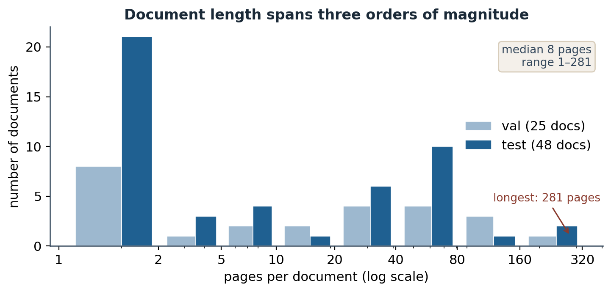
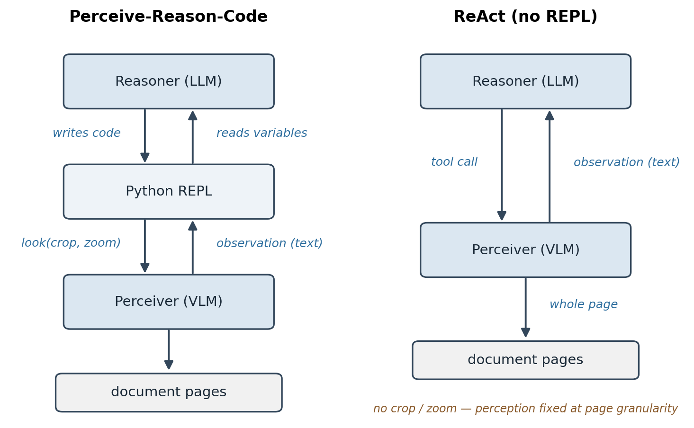
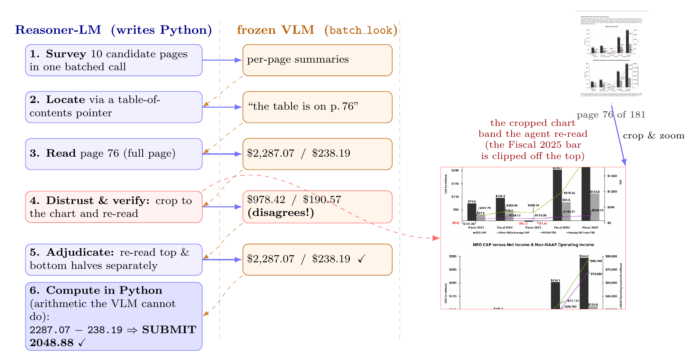
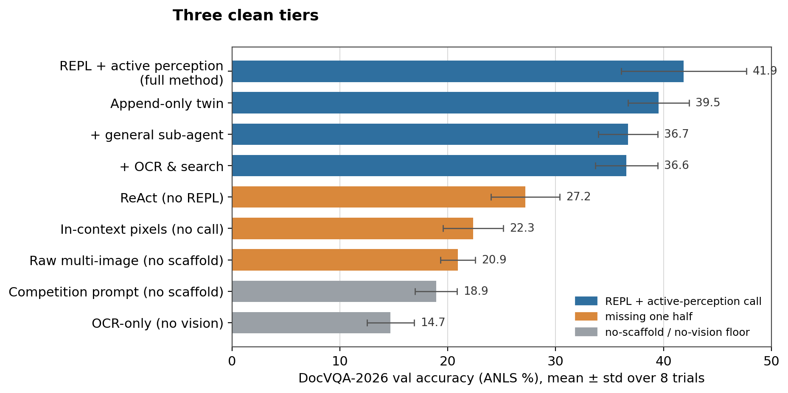
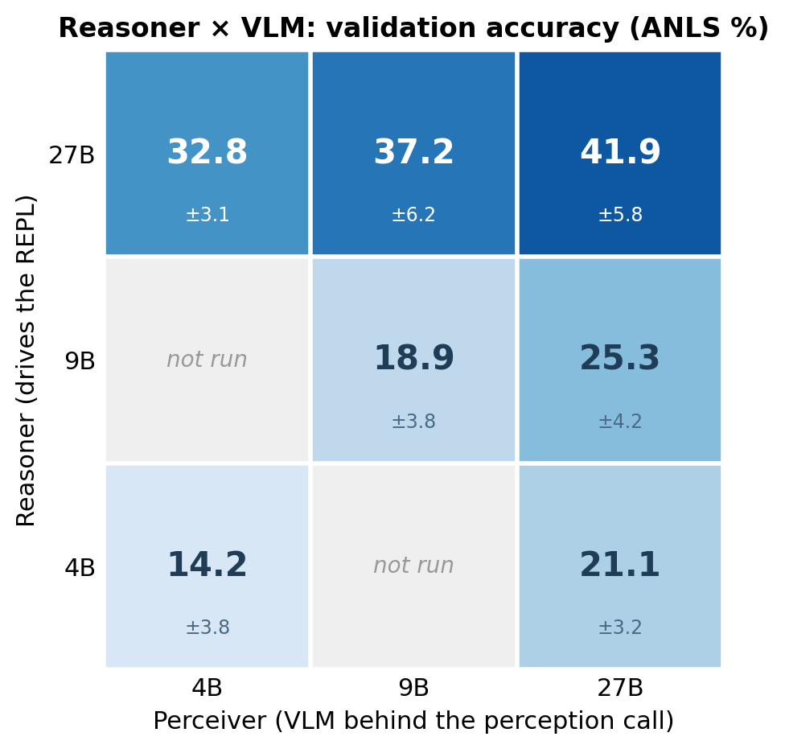
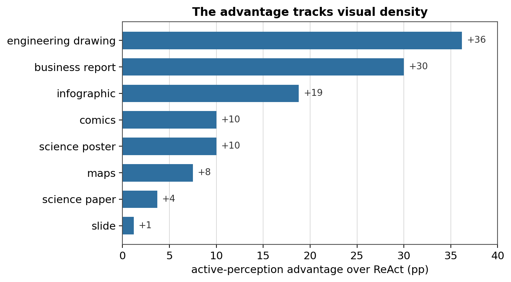
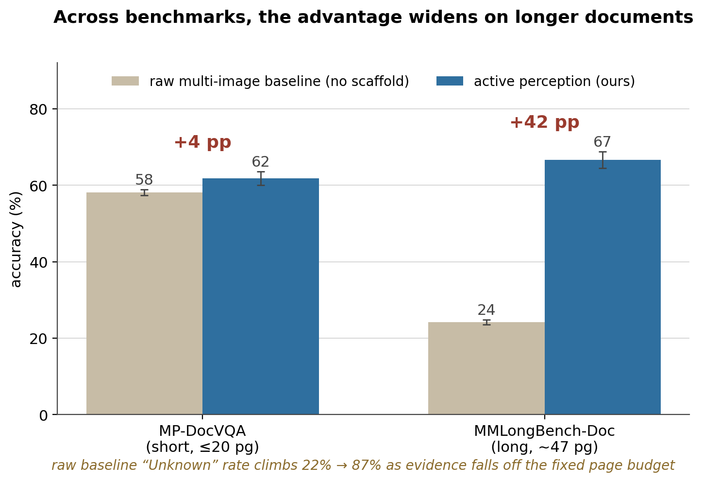

[Code: github.com/bdsaglam/docvqa](https://github.com/bdsaglam/docvqa){.more}

<details class="tldr">
<summary>TL;DR</summary>

We [jointly won the 8–35B tier](https://rrc.cvc.uab.es/?com=news&view=data&id=83)
of the [ICDAR 2026 DocVQA challenge](https://rrc.cvc.uab.es/?ch=34). An open
Qwen 3.5 27B beat the challenge's bare-model baselines, the much larger
Gemini 3 Pro and GPT-5.2, on the held-out test set. Our approach is a Python
REPL plus a single perception tool: a vision model the reasoner points at any
region of any page, so it decides where to look instead of reading whole pages at
a fixed resolution. Those two parts carry the result, and only together; the
usual additions (a general sub-agent, clever trajectory management, the OCR and
search our competition entry used) add nothing or cost accuracy. Perception is the constraint: a dense page defeats a single
fixed-resolution look, whoever is looking. But the reasoner is the lever.
Scaling the reasoner moves accuracy about twice as much as scaling the VLM it
looks through, and a strong coding reasoner driving a small VLM beats a small
reasoner driving a strong one. The approach builds on
RLM, CodeAct, and the code-as-vision line; the contribution is putting them
together for documents, and the ablations behind every claim above.

</details>

## A 27B model, a Python REPL, and one question

We [jointly won the 8–35B tier](https://rrc.cvc.uab.es/?com=news&view=data&id=83)
of the [ICDAR 2026 DocVQA challenge](https://rrc.cvc.uab.es/?ch=34) with an
open Qwen 3.5 27B: on the held-out test set, our system beat the challenge's
bare-model baselines, the far larger Gemini 3 Pro and GPT-5.2. What we entered was
one idea: let a code-capable model direct its own perception from inside a
Python REPL. At its core the system is two things: the REPL, and an on-demand
call to a vision-language model (VLM), used as a perception tool the reasoner
invokes region by region.

The leaderboard result is a single number; the sharper question is where the lift
comes from. So this post takes the system apart, one piece at a time: **which
components carry the lift, and which are just along for the ride?**

The answer turns out to be short: the REPL and the perception call, and only the
two together. The rest (a general sub-agent, clever trajectory management, an OCR
pipeline) doesn't help, and mostly hurts. And underneath sits
a reframe for anyone building multimodal agents: on documents, perception is the
constraint, but **the reasoner is the lever**. No model can afford to see a dense
page all at once; what separates systems is how well the reasoner directing the
looks spends its limited budget of them.


## The result

The challenge scores one submitted answer per question on a held-out test set. We
compute each of ours by self-consistency voting over a handful of samples. Two of
the entries below are ours: an entry tuned to this benchmark, and the streamlined
general method this post describes. Both clear the challenge's official baselines. Those baselines are bare
models, reported with no agentic scaffold, so the fair reading is a harnessed 27B
against unharnessed frontier models.

| System (held-out test set) | Score |
|---|---|
| **Qwen 3.5 27B (ours), tuned entry** | **43.8%** |
| **Qwen 3.5 27B (ours), general method** | **39.4%** |
| Gemini 3 Pro | 37.5% |
| GPT-5.2 | 35.0% |
| Gemini 3 Flash | 33.8% |
| GPT-5 Mini | 22.5% |

: **Table 1.** Held-out test-set ANLS.

The **tuned entry** scored higher because it was fitted to this benchmark:
DocVQA-specific prompts, plus the OCR and search we spend the post stripping away.
The **general method** drops all of that and still clears the frontier. This post
is about the general one.

These test numbers sit below our validation numbers. The gap could be a harder test
split as much as any fit to the set we developed against; the general method strips
most of the benchmark-specific prompting, so we don't read it as mostly overfitting.
We don't claim the validation figures transfer untouched to test.

Either way, the takeaway isn't the leaderboard position. It's *how* the score was
reached. A lot of strong document-VQA systems get there by fine-tuning on tens of
thousands of question-answer pairs, or by building a specialized OCR-and-encoder
pipeline. The general method needs neither. The model is stock Qwen 3.5 27B, and the
system is a REPL and one perception call.

> **On this task, harness design substituted for fine-tuning.** Before you reach
> for training data or a specialized pipeline, see how far a general
> model gets when you let it direct its own perception.

So what makes this task hard enough to need a system like that?


## The challenge

Document visual question answering (Mathew et al., 2021) is what it sounds like: you're handed a document
and a question in plain language, and you have to answer it. The catch is what
counts as a "document." In the ICDAR 2026 DocVQA challenge a single item might be a
one-page infographic or a 281-page annual report, and the answer might be a value
in a merged table cell, a label on an engineering drawing, a figure on a crowded
chart, a date in a form, or something you only get by reading two pages and doing
arithmetic.

So before any reasoning happens, there's a *finding* problem, and it runs along two
axes at once. **Across pages:** the evidence lives on one of up to 281, so you have
to find the right page first. **Within a page:** the page itself can be *large*
(thousands of pixels on a side) and *dense* (a crowd of labels, cells, and lines),
so the answer occupies a tiny fraction of it, well below what a single
fixed-resolution read can resolve. Locate the page, then the region on it, *then*
read, often compositing or computing over what you found. That's the part
general-purpose VLMs struggle with: hand one all the pages at
once and it reads each at a fixed resolution with a fixed slice of attention. On a
sparse page that's fine. On a large, dense one it isn't.

The scale of the finding problem is easy to miss. Across the challenge, documents
run from a single page to 281, with a median of 8. Most are short. A long tail is
not.

{fig-alt="document length distribution"}

**Figure 1.** Document length across the DocVQA-2026 validation and test sets.

That gap, between what's on the page and what a single read can resolve, is the
whole game. The question is what to do about it. The obvious moves are to use a
bigger model or to stuff more pages into the context window. The move that actually
worked was to let the model decide *where to look*.


## The method

Picture how a person answers a question from a hundred-page report. They do not
read every page at a uniform squint. They flip to the section that matters, lean in
on the one figure or table the question turns on, re-read a caption when a number
looks wrong, and do the arithmetic on a notepad. It holds even on a single sheet:
hand someone a large, dense map and they still work it region by region, finding the
legend, then the area they need, then the labels there, never in one glance.
Attention goes where the evidence is, a piece at a time. Active perception gives a
model the same habit.

The whole method fits in one sentence. Give a code-capable model a persistent
Python REPL and a single perception primitive (an on-demand call to a VLM,
pointed at any region of any page), and let it *direct* perception instead of
swallowing the document whole. It can crop to the evidence, zoom for acuity, sweep
pages in a loop, composite regions, and do in code the coordinate math and
arithmetic a VLM is bad at. Perception becomes something the model spends
deliberately, a region at a time, rather than a single fixed gulp of pixels. Three
moves give the system its name, **Perceive-Reason-Code**: perceive through a VLM
call, reason in language, act by writing code.

Unless noted otherwise, every
experiment below uses Qwen 3.5 27B as both the reasoner and the VLM, on the
DocVQA-2026 validation set (25 documents, 80 questions), eight trials, scored by
ANLS (the fuzzy string-match metric DocVQA uses), reported as mean ± std.

{fig-alt="two agent architectures side by side: the active-perception loop where the reasoner writes code that calls a VLM on chosen crops, versus a ReAct agent with the same VLM but no code REPL"}

**Figure 2.** Left: the active-perception loop. The reasoner writes code, the
code calls the VLM on a chosen crop, and the returned text flows back into the REPL
as the next observation. Right: a ReAct agent (Yao et al., 2023): the same VLM
through plain tool calls, no code environment, so it reads only whole pages with no
way to crop, compose, or compute.

Concretely, the loop is the familiar agent shape: a **state** (a representation of
the run so far), an **action** (a block of Python the model writes), and an **observation**
(whatever that code prints, including the text a perception call returns). Hold
onto that framing: how the state is represented comes back in the ablations,
where it matters for training rather than accuracy.

Here is one run of the loop on a real question: the gap between two values on a
chart buried in a 181-page report.

{fig-alt="representative trajectory: reasoner-LM writes Python that calls a VLM on chosen regions"}

**Figure 3.** One run of the loop (16 iterations, correct). It surveys ten candidate
pages in one batched call, locates the table via a table-of-contents pointer, reads a
page whole and distrusts the number it gets, crops to the chart band and re-reads,
then does the subtraction in Python, where it's exact.

The whole-page read returned $978.42, and it was wrong. The crop caught it.

One setup detail: these runs disable the model's native "thinking"
channel.[^think] The reasoning is still there; it just moves into the visible
body of each turn, where the code and the comments live.

### Related work

Perceive-Reason-Code stands on a few well-tested ideas. The REPL-with-a-sub-call
shape comes from **Recursive Language Models** (RLM; Zhang et al., 2025): the model works
inside a code environment where the document is just a variable it can slice and
inspect with code, and it can fire off a sub-call to a model when it needs one.
Writing actions *as code* rather than as JSON tool calls is **CodeAct** (Wang et
al., 2024). Orchestrating vision modules with a program goes back to **VisProg**
(Gupta & Kembhavi, 2023) and **ViperGPT** (Surís et al., 2023). The move here is to put them together for documents, with the sub-call
specialized as visual perception. (When the same model serves both roles, the
perception call is the model calling itself; nothing turns on that, and we treat
it simply as one primitive the reasoner invokes as often as it needs.)

RLM had already shown, for *text*, that the REPL alone lifts a baseline and a
sub-call lifts it further. The question this post answers is whether that holds when
the sub-call is a *VLM* over a stack of document images. Active perception over a
single image is not new: **DeepEyes** (Zheng et al., 2025) trains a model to
zoom into an image region to answer, and concurrent work, **RVLM** (Recursive
Vision-Language Models with Adaptive Depth; Mayumu et al., 2026), applies the same
REPL-plus-sub-call shape to single-image medical scans. Our setting is the multi-page
document, where the evidence must first be found, across pages and within them. What none of this settles is
which piece of the harness carries the result; the ablations do.

[^think]: We run with `enable_thinking=false` for cost and reproducibility.
Re-enabling it doesn't change the picture (a separate ablation moves it less than
the trial-to-trial noise).


## Ablations

The harness has a few moving parts: a Python REPL, a VLM that the agent calls as a
perception tool, and the loop that ties them together. Which of those is doing the
work? The clean way to find out is to remove one part at a time and watch the
score move. Every run keeps the same answer-formatting rules; only the structure
changes.

Two configurations run the full loop, and they need names. The one our entry ran,
and the one every headline number in this post reports, is **RLM**: a direct
instance of the Recursive Language Models scaffold, conditioning on a compacted
state (a sliding window of recent REPL steps). Its twin, **CodeAct**, runs the
same loop but conditions on the full transcript of every turn. Both do active
perception; they differ only in how they represent the trajectory, a difference
one ablation below treats on its own. **ReAct** keeps the same VLM perception
tool but no REPL.

Before the knockouts, here are the main configurations, one per row.
**avg@1** is the headline single-trial accuracy (mean ± std over eight trials); the
last two columns are two diagnostics behind it, **pass@8** (coverage, whether any
of the eight trials is correct) and **SC@8** (the self-consistency vote we actually
submit).

| Configuration | avg@1 (± std) | pass@8 | SC@8 |
|---|---|---|---|
| **RLM (full method)** | **41.9 ± 5.8** | **68.8** | **47.5** |
| &nbsp;&nbsp;+ general sub-agent | 36.7 ± 2.8 | 66.3 | 41.3 |
| &nbsp;&nbsp;+ OCR & search | 36.6 ± 2.9 | 67.5 | 40.0 |
| CodeAct | 39.5 ± 2.8 | 63.8 | 45.0 |
| ReAct (no REPL) | 27.2 ± 3.2 | 53.8 | 32.5 |
| Raw multi-image (no scaffold) | 20.9 ± 1.6 | 27.5 | 20.0 |
| Competition prompt (no scaffold) | 18.9 ± 1.9 | 33.8 | 21.3 |
| OCR-only (no vision) | 14.7 ± 2.2 | 27.5 | 15.0 |

: **Table 2.** The main configurations by headline accuracy (avg@1), coverage (pass@8), and self-consistency (SC@8). Validation, eight trials.

Those two diagnostic columns say more than the headline mean. Self-consistency
(SC@8) buys a few points over a single trial, which is why our test submissions
vote. And pass@8 sits far above single-trial accuracy on the strong scaffolds: 68.8
against an avg@1 of 41.9, and 63.8 against 39.5 for CodeAct.
Coverage that high says the scaffold's sampling
explores a diverse enough solution space to reach the answer far more often than it
reliably produces it. (pass@8 is also the upper bound for any way of picking among
the eight; SC@8 is one realizable pick, and it recovers only part of the gap.) We
return to that gap at the end.

Now the mechanism, one part at a time. Start at the top and take away the REPL. What's left is a **ReAct agent**: the
same VLM perception tool, but called through plain tool-use instead of from inside
a code environment. The score falls from **41.9%** to **27.2%**, about fifteen
points. Without a REPL the agent can't crop a region by arithmetic, can't tile a
page, can't subtract two numbers it just read; it asks for whole pages and stops
early (around five steps per question). The REPL isn't a convenience. It's the
thing that lets reasoning turn into *targeted* perception.

Now do the opposite: keep the REPL, take away the perception *call*. Give the
agent a `display()` that loads the page pixels straight into its own context, so
it looks at the document itself instead of asking a focused VLM call to look and
report back. This is DeepEyes' perception channel driven from a REPL: the model
inspects its own crops in-context, except that DeepEyes trains the habit with RL
and here it is prompted. It collapses too, down to **22.3%**. The agent also thrashes: it
runs 30+ steps per question and pins the iteration cap on most of them, grinding
without converging.

That second result is exactly what the RLM line would predict. Stuffing raw
content into the reasoner's own context degrades it: the familiar context-rot
effect, where a model handles a long or noisy context worse than a clean one. RLM
tells this story for long text; here it shows up for pixels, and it pins down
*which* half does the work. Having a REPL isn't enough on its own; the perception
has to go through **a call that returns compact text**, not be poured into the
reasoner's own window.

Put the two knockouts together and you get a clean 2×2:

| | **w/ sub-VLM** | **w/o sub-VLM (pixels in-context)** |
|---|---|---|
| **w/ REPL** | **41.9%** (full method) | 22.3% (`display()` only) |
| **w/o REPL** | 27.2% (ReAct) | 20.9% (raw multi-image, no scaffold) |

: **Table 3.** The two halves of the scaffold, ablated: the REPL crossed with the sub-VLM call (validation ANLS).

Drop either half and you land in the low-to-mid 20s, near the no-scaffold
baseline. The lift lives in the combination: a code REPL **and** an on-demand VLM
perception call.

Plotted together, the configurations fall into three tiers whose gaps dwarf the
spread within each.

{fig-alt="horizontal bar chart of configurations sorting into three accuracy tiers: REPL plus active perception on top, missing one half in the middle, and an OCR-only floor at the bottom"}

**Figure 4.** Validation accuracy (avg@1 ± std, eight trials each) for every
configuration, colored by tier: REPL + active perception, missing one half (no REPL
or no perception call), and the no-scaffold / OCR-only floor.

### Three things that don't help

The obvious ways to enrich the core don't make it any bigger, and two make it
smaller; these results tell you what you *don't* need to build.

**Generalizing the call costs points.** We replaced the focused "look at this
region" call with a general sub-agent that could take on any subtask (image
optional). Accuracy regressed: **36.7%**, five points below the plain call. And
when we logged what the agent actually asked the sub-call to do, about **99%**
of the calls were still plain perception. One focused perception primitive
already captures the benefit; the extra generality is pure overhead. (We use one
level of perception call throughout; we never tried stacking them deeper.)

**The trajectory format doesn't matter, for inference.** RLM conditions on a
compacted representation of the run: a sliding window of its recent REPL steps,
not every turn in full. CodeAct keeps the **full trajectory** instead, never
compacting, a fully-observable log of every
turn. The two tie: **39.5%** vs 41.9%, within a couple of points, and
CodeAct doesn't even lose ground on longer documents (the per-document
gap is uncorrelated with page count). For getting the answer, how you represent
the trajectory is a wash.

It does, though, matter for something else: **training**. If you ever want to
*train* the agent (with reinforcement learning, or by distilling a stronger one),
the methods assume the model's output grows as a clean prefix. Turn *t* is just
turn *t−1* with more appended. Compaction breaks that: it rewrites the history
between turns, so the sequence is no longer a growing prefix. The full trajectory
keeps it, which makes it the more *trainable* of the two. And, as we
just saw, choosing it costs nothing in accuracy. (Making compacted trajectories
trainable anyway is its own open problem; FoldAct (Shao et al., 2025) is an early attempt.)
We'll come back to this at the end.

**Our OCR pipeline costs accuracy when added on top.** The pipeline is docling
for layout-aware page text, IBM granite-vision (a 2B vision-language model) for
captioning the embedded figures and charts, and a BM25 index for lexical search.
Wire all three into the full method and the score drops to **36.6%**. The drop
has a clear mechanism. OCR reads each page whole, in one fixed pass with no
crop or zoom, which is exactly the reading mode the scaffold exists to escape,
so on dense regions its parse is unreliable. And because the parse arrives as
confident text, the reasoner leans on it instead of aiming the perception call:
it takes a misread value or a flattened table at face value and answers without
a verifying look, even though its prompt says to check critical values
visually. This is a verdict on the pipeline we ran, not on OCR in general; a
stronger engine, better matched to these layouts, might surface detail ours
missed. The one we used didn't just fail to beat looking; it crowded looking
out.

So the core that matters is small: **a REPL plus one active-perception call.**
The trajectory format is a free choice; generality and our OCR-on-top were net
negatives.

That leaves one more knockout, the one that says what kind of problem this is.

### Passive perception is the floor

**Swap the actively driven VLM for a precomputed pipeline.** The reasoner in
the full method never looks at the pixels; everything it knows arrives as text
a VLM reported about regions it chose. This knockout keeps the reasoner, the
REPL, and the text interface, and changes only where the text comes from. The
agent now works over the output of our OCR pipeline, built once per document
before any question is asked: page text, a small VLM's captions for the figures
and charts (so the channel even contains some vision), and a search tool over
it all. Perception still happened; none of it was the reasoner's doing. It
scores **14.7%**, the floor of the study, below even the no-scaffold
competition prompt, with zero out of ten on layout-bound categories
(engineering drawings, maps) in all eight trials.

Some of the floor is simple quality: the pipeline's perceiver is small, it
reads whole pages, and its misreads are baked in. But quality is not the main
story. Hand the same reasoner a far weaker perceiver than its usual 27B, a 4B
VLM, and let it drive it, region by region, question by question, and it
scores 32.8 (next section): more than double the passive channel. What collapses at 14.7 is not perception but agency over it. Every
page was read once, whole, and question-blind, and no amount of searching that
transcript recovers what a directed look would have caught. Active use of a
mediocre perceiver beats passive consumption of any perception pipeline we
built.

### Better eyes, or a better director?

The knockouts pin the scaffold's contribution to perception: swap whole-page
ReAct for RLM with the same 27B on both sides, and accuracy jumps
from 27 to 42, with nothing changing but how perception is spent. To see where the
remaining headroom lives, we scale each half separately: 4B, 9B, and 27B Qwen as
the reasoner, crossed with the same three sizes as the VLM behind the perception
call.

{fig-alt="heatmap of the reasoner-by-VLM matrix: accuracy rises modestly left to right with a stronger VLM and sharply bottom to top with a stronger reasoner"}

**Figure 5.** Validation accuracy (ANLS %, mean ± std over 4–8 trials per cell)
for each reasoner × VLM pairing of Qwen 3.5 4B/9B/27B, all under the same RLM
harness.
The grey cell was not run. The 27B row and the 4B-reasoner/9B-VLM cell use the
exact configuration reported everywhere else in the post; the remaining cells use
a minimally different prompt variant of the same solver (identical harness and
tools).

Read the matrix **across a row**: the reasoner stays fixed and only the eyes
improve. Accuracy climbs at every reasoner size, +6.9 with the 4B reasoner, +6.4
with the 9B, and +9.1 end to end on the 27B row (32.8 with 4B eyes, 37.2 with 9B,
41.9 with 27B), all well outside the noise.[^stats] Better eyes help; they are
also the smaller axis.

Now read **down the rightmost column**: the VLM stays at 27B and the reasoner
scales, and accuracy nearly doubles. Does that leverage need the loop? Put the
same ladder of reasoners behind ReAct:

| Reasoner | RLM | ReAct |
|---|---|---|
| 4B | 21.1 | 18.1 |
| 9B | 25.3 | 22.7 |
| 27B | 41.9 | 27.2 |

: **Table 4.** Fixing the VLM at 27B and varying the reasoner (validation ANLS).

Going from a 9B reasoner to a 27B one adds **+16.6pp** in RLM but
only **+4.5pp** in ReAct: the same extra reasoning capacity is worth three to four
times as much when the model has an actuator to spend it through. A whole-page
reader can think harder about a page it still cannot resolve, but its ceiling is
whatever one downsampled look yields, and a smarter reasoner cannot aim it. Give
that reasoner a perception tool and its capacity turns into accuracy: it writes
tighter crops, cleaner code, and decides where to look again.

Now put the two mixed corners of the matrix side by side. A 4B reasoner given the
27B VLM reaches **21.1**. A 27B reasoner peering through the 4B VLM reaches
**32.8**. The strong director with weak eyes wins by almost twelve
points, and it even clears the ReAct agent that has the full 27B as its eyes
(27.2). Between a stronger VLM and a stronger director, buy the director.

If perception is the bottleneck, the advantage should be largest where a page packs
the most fine detail, and it broadly is.[^length] The per-category gap between the
RLM agent and the ReAct baseline tracks visual density, though with
few questions per category the ranking matters more than the exact points:

{fig-alt="bar chart of the active-perception advantage over ReAct by document category, largest on dense structured pages like engineering drawings and smallest on text-linear pages"}

**Figure 6.** RLM's advantage over ReAct (ANLS points), by document
category: engineering drawings +36, business reports +30, infographics +19, science
papers +4, slides +1. Maps are a hard case for every configuration.

So is the bottleneck perception or reasoning? Perception is what binds in the
moment: no single look resolves a dense page, and perception done in advance
does not replace directed looks. But the leverage sits
with the reasoner: at a fixed 27B VLM, scaling the reasoner adds +20.8 points; at
a fixed 27B reasoner, scaling the VLM adds +9.1. And that leverage exists only
inside the loop; ReAct's much shallower column in Table 4 shows what the same
capacity yields without it. The practical corollary is the one the corners show: the VLM
does not have to be great, so long as the director aiming it is.

One caveat bounds the reasoning half of this. The data does not separate how much of a stronger reasoner's lift comes from sharper aiming (better crops and code) versus sharper reasoning over what it then sees. That decomposition stays open.

[^stats]: +6.88pp at 4B (Welch *t* = 3.91, 95% CI [+3.1, +10.7]) and +6.41pp at 9B
(*t* = 3.21, 95% CI [+2.1, +10.7]), eight trials per arm; +9.07pp at 27B
(*t* = 3.52, 95% CI [+3.3, +14.8]), four trials against eight.

[^length]: Within-set, the "advantage grows with page count" hypothesis doesn't
hold: on the longest documents with a strong VLM the gap is flat. Across
benchmarks of very different length, a budget effect does appear, which the
document-length section takes up directly.


## The lift generalizes across model sizes and families

Our entry used Qwen 3.5 27B, but nothing in the method is specific to it. To check,
we run the harness homogeneously (the same model as both reasoner and VLM) across
sizes and across a second family.

| Model | ReAct | RLM | CodeAct |
|---|---|---|---|
| Qwen 3.5 4B | 13.4 | 14.2 | 16.3 |
| Qwen 3.5 9B | 16.3 | 18.9 | 23.0 |
| Qwen 3.5 27B | 27.2 | **41.9** | 39.5 |
| Gemma 4 31B | 18.4 | 33.0 | 30.3 |
| Gemma 4 E4B | 6.1 | 7.3 | 7.8 |

: **Table 5.** Homogeneous model axis: validation ANLS by harness, across model sizes and families.

The code-REPL harnesses (RLM and its CodeAct twin) beat the no-REPL ReAct agent at
every capable size, and the margin scales with model capability: a point or two at
4B, about fifteen points at Qwen 27B and Gemma 31B. But the lift is gated by
capacity. Gemma 4 E4B falls below the gate: no harness clears the no-scaffold
baseline (around 6), because the model cannot write the code to drive the loop.
The harness amplifies a capable model; it cannot rescue one that cannot code.

The gate is about capability, not family or checkpoint: any model that is a
strong enough multimodal coder gets the lift. Qwen 3.5 27B is simply the one we
entered in the challenge. The method is about the harness, not the model.


## The advantage grows with document length

Document length is an axis of its own, and across benchmarks it separates the
methods cleanly once documents get long. To see it, run RLM and the raw
multi-image baseline on two benchmarks of very different length: MP-DocVQA (short,
at most 20 pages, mean 5.3, scored by ANLS; Tito et al., 2023) and MMLongBench-Doc
(long, around 47 pages, scored by a Qwen judge; Ma et al., 2024). Both on
stratified-random subsets, n=3, Qwen 3.5 27B.

{fig-alt="the active-perception advantage grows with document length across benchmarks"}

**Figure 7.** RLM's advantage over the raw multi-image baseline on MP-DocVQA
(short documents) and MMLongBench-Doc (long). Qwen 3.5 27B, n=3, mean ± std.

On the short benchmark the gap is about 4 points (61.8 against 58.1). On the long
one it is about 42 (66.6 against 24.2). The baseline is the same raw multi-image
configuration as in the ablations; nothing changed between the two benchmarks but
the documents.

The mechanism is visible in how each method moves across the axis. RLM stays
flat, because it navigates the document regardless of length. The raw
multi-image baseline degrades. Its "Unknown" rate (the questions where it
cannot find the evidence) climbs from about 22% on short documents to about 87% on
long ones, as the evidence falls off the end of a fixed page budget.

So length is one axis along which the advantage grows, and it dominates once
documents are long. On moderate collections like DocVQA-2026 the page budget
barely binds; the large edge there comes from a different axis, within-page
density.


## Limitations

Everything good about this method (general model, no training, no domain
pipeline) is bought with one currency: **calls**. Perception happens a region at a
time, each region is a VLM call, and the calls are sequential because each one
depends on what the last one returned. The full method averages around **13 steps
per question**; the in-context-pixels variant, which never converges, runs more
than twice that and pins the cap.

| Configuration | Steps / question |
|---|---|
| RLM (ours) | ~13 |
| ReAct (no REPL) | ~5 |
| In-context pixels (no perception call) | ~30 (caps out on most questions) |
| Raw multi-image (no scaffold) | 1 |

: **Table 6.** Model calls (steps) per question, by configuration.

So the method trades latency and token cost for accuracy and generality. On the
heaviest documents it can run up against the model's context limit outright, and
the self-consistency voting behind our test submission multiplies the cost several times over.
This isn't a small caveat. It's the reason you'd hesitate to put this exact
configuration in front of a latency-sensitive user.

MADQA (Borchmann et al., 2026) shows how far this can run: an unconstrained
recursive agent can be flexible *and* ruinously expensive. In their setting, such
an agent burned on the order of 270M input tokens and several hundred dollars on a
task it then *lost* to a far cheaper retrieval agent. Flexibility has a bill attached.

More steps mark a *hard* document, not a path to a better answer: across
questions, trajectory length is mildly *negatively* correlated with correctness.
Grinding longer is a symptom, not a fix.

The encouraging part is that we left the efficiency levers untouched, so there is
clear room:

- **Cut calls with cheap retrieval.** High-quality OCR run once as preprocessing,
  plus a searchable index, would let the agent jump to the right page instead of
  sweeping, fewer perception calls for the same evidence.
- **Make each call cheaper.** The reasoner and the VLM don't have to be the same
  model. The cross-model runs price this trade: a 4B VLM behind the 27B reasoner
  keeps 32.8 of the 41.9, about three-quarters of the accuracy at a fraction of
  the per-call cost, and a document-specialized small VLM could close more of
  the gap.

And this reframes the OCR result from earlier. As an *evidence* channel our OCR
pipeline cost accuracy, but run once as preprocessing it still buys
**efficiency**: fewer and cheaper looks. The extension to keep uses OCR for
navigation, not as evidence.

Beyond cost, a few limits bound the claims. The test numbers sit below validation
(a harder test split is at least as plausible a reason as fit to the development
set). The scaffold has a floor: it amplifies a capable coder but cannot rescue a
model too weak to drive the loop. And the data does not separate how much of a
stronger reasoner's lift is sharper aiming versus sharper reasoning. None of
these moves the central picture.

Set the caveats aside for a moment, because the REPL is really an instance of a
more general idea.


## Code as a substrate for learning

Strip away the document-specific framing and here's what the REPL really is: a
**symbolic substrate** for a neural model. Code is the medium the model explores
in, composes in, and computes in: a place to hold and manipulate things its own
context can't. Active perception is just one instance of it: the model writes code
to *aim its own eyes*, and the code does the cropping and the arithmetic that the
network is bad at. The neural part proposes; the symbolic part executes and
remembers.

Using this substrate at *inference* is already common: frontier models interleave
code execution and tool calls with their reasoning. The results here add a
document-domain instance, with the twist that the code aims a second model's
perception.

The open question is about *learning*. Everything above uses the substrate at
deployment: the weights stay frozen, and the harness wraps around them from the
outside. What if it were woven into how the model is trained instead? Not a
scaffold you remove, but a native faculty: to compose, to compute, to aim its own
perception. That is a sharper and more uncertain claim than "code helps agents,"
and it is the one we keep coming back to.

Two things from this study make it feel concrete rather than idle. First, we
already know which form is trainable: the append-only trajectory ties the compacted
one on accuracy but keeps the clean, growing-prefix structure that learning methods
assume. And making folded trajectories trainable is itself an active problem.
Second, the coverage gap is just sitting there: for CodeAct, pass@8 is
about 24 points above what a single trial reliably produces. The answer is already in
reach; the model just does not land on it by default. That is not noise. It is
exactly the kind of signal a learning procedure exists to capture.

We got these results by letting a frozen model write code to look more carefully.
The thread worth pulling next is whether a model trained to use the substrate, so
that neural and symbolic computation are learned together rather than stitched
together at inference, outgrows one that only borrows it at answer time.


## References

- Zhang, A. L., Kraska, T., & Khattab, O. (2025). Recursive Language Models. [arXiv:2512.24601](https://arxiv.org/abs/2512.24601).
- Mayumu, N., et al. (2026). Recursive Vision-Language Models with Adaptive Depth (RVLM). [arXiv:2603.24224](https://arxiv.org/abs/2603.24224).
- Wang, X., et al. (2024). Executable Code Actions Elicit Better LLM Agents (CodeAct). ICML. [arXiv:2402.01030](https://arxiv.org/abs/2402.01030).
- Yao, S., et al. (2023). ReAct: Synergizing Reasoning and Acting in Language Models. ICLR. [arXiv:2210.03629](https://arxiv.org/abs/2210.03629).
- Gupta, T., & Kembhavi, A. (2023). Visual Programming: Compositional Visual Reasoning Without Training (VisProg). CVPR. [arXiv:2211.11559](https://arxiv.org/abs/2211.11559).
- Surís, D., Menon, S., & Vondrick, C. (2023). ViperGPT: Visual Inference via Python Execution for Reasoning. ICCV. [arXiv:2303.08128](https://arxiv.org/abs/2303.08128).
- Zheng, Z., et al. (2025). DeepEyes: Incentivizing "Thinking with Images" via Reinforcement Learning. [arXiv:2505.14362](https://arxiv.org/abs/2505.14362).
- Borchmann, Ł., et al. (2026). Strategic Navigation or Stochastic Search? How Agents and Humans Reason Over Document Collections (MADQA). [arXiv:2603.12180](https://arxiv.org/abs/2603.12180).
- Shao, J., et al. (2025). FoldAct: Efficient and Stable Context Folding for Long-Horizon Search Agents. [arXiv:2512.22733](https://arxiv.org/abs/2512.22733).
- Mathew, M., Karatzas, D., & Jawahar, C. V. (2021). DocVQA: A Dataset for VQA on Document Images. WACV. [arXiv:2007.00398](https://arxiv.org/abs/2007.00398).
- Tito, R., Karatzas, D., & Valveny, E. (2023). Hierarchical Multimodal Transformers for Multi-Page DocVQA (MP-DocVQA). [arXiv:2212.05935](https://arxiv.org/abs/2212.05935).
- Ma, Y., et al. (2024). MMLongBench-Doc: Benchmarking Long-context Document Understanding with Visualizations. [arXiv:2407.01523](https://arxiv.org/abs/2407.01523).


## Citation

If you found this useful:

> Sağlam, B. D. (2026). *Perceive-Reason-Code: Active Perception for Document VQA.* https://barisdeniz.is-a.dev/posts/perceive-reason-code/

```bibtex
@misc{saglam2026prc,
  author       = {Sağlam, Barış Deniz},
  title        = {Perceive-Reason-Code: Active Perception for Document VQA},
  year         = {2026},
  howpublished = {\url{https://barisdeniz.is-a.dev/posts/perceive-reason-code/}}
}
```
