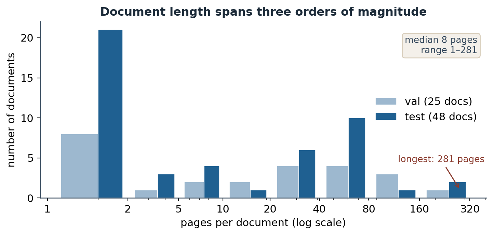
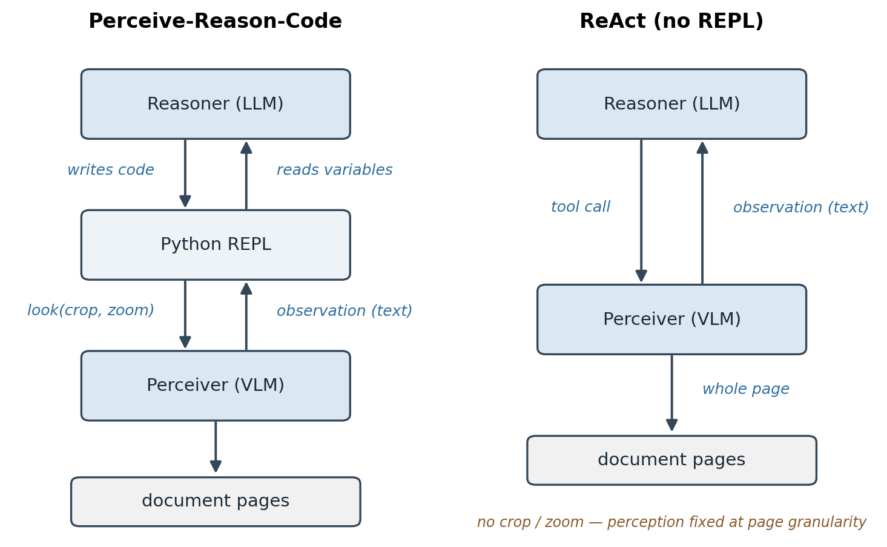
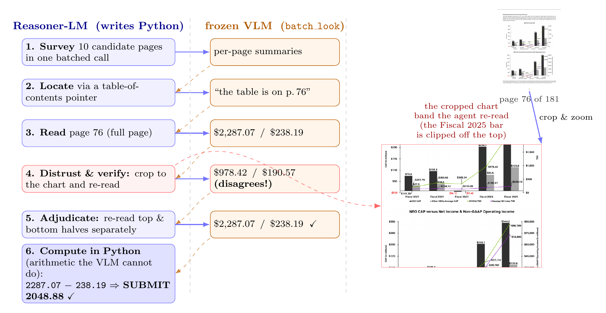
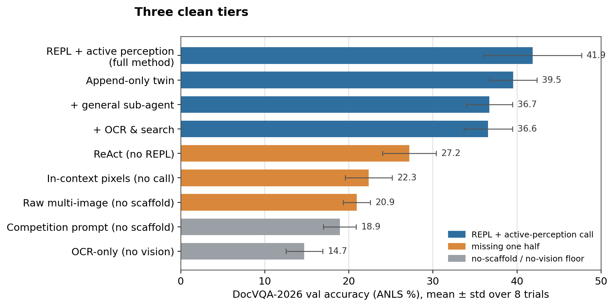
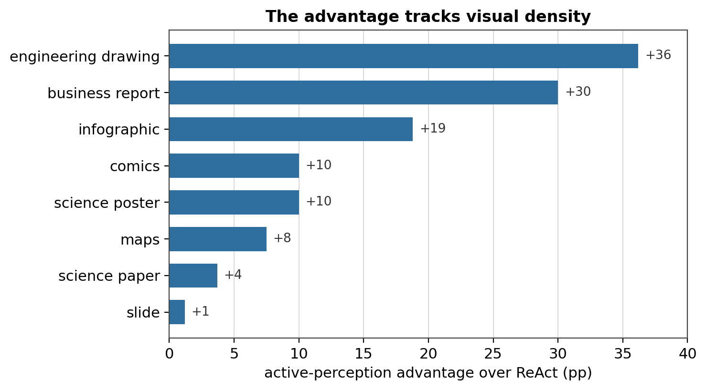

[Code: github.com/bdsaglam/docvqa](https://github.com/bdsaglam/docvqa){.more}
&nbsp;·&nbsp;
[Poster (PDF)](poster.pdf){.more}

<details class="tldr">
<summary>TL;DR</summary>

We [jointly won the 8–35B tier](https://rrc.cvc.uab.es/?com=news&view=data&id=83)
of the [ICDAR 2026 DocVQA challenge](https://rrc.cvc.uab.es/?ch=34). An open
Qwen 3.5 27B beat the challenge's bare-model baselines, the much larger
Gemini 3 Pro and GPT-5.2, on the held-out test set. The system is a Python REPL
plus one perception tool, a vision model the reasoner can point at any region
of any page, so it decides where to look instead of reading whole pages at a
fixed resolution. Ablations show the gain needs both parts together, and that
the usual additions (a general sub-agent, trajectory-management tricks, the OCR
and search our competition entry used) add nothing or cost accuracy. No model
can resolve a dense page in one fixed-resolution look, so accuracy depends on
how well the looks are directed, and directing them is the reasoner's job:
scaling the reasoner moves accuracy about twice as much as scaling the VLM it
looks through, and a strong coding reasoner driving a small VLM beats a small
reasoner driving a strong one. The approach builds on RLM, CodeAct, and the
code-as-vision line; the contribution is the combination for documents, with
ablations behind every claim.

</details>

We [jointly won the 8–35B tier](https://rrc.cvc.uab.es/?com=news&view=data&id=83)
of the [ICDAR 2026 DocVQA challenge](https://rrc.cvc.uab.es/?ch=34) with
Qwen 3.5 27B: on the held-out test set, our system beat the challenge's
bare-model baselines, including the far larger Gemini 3 Pro and GPT-5.2. The
system gives a code-capable model a persistent Python REPL and an on-demand
call to a vision-language model (VLM), which the model can point at any region
of any page.

A leaderboard score doesn't say which part of a system earned it, so we ablated
the harness on the validation set. The gain comes from
the REPL and the perception call together; removing either collapses it, and
the usual enrichments (a general sub-agent, trajectory-management tricks, an
OCR pipeline) add nothing or cost accuracy. The ablations also say where to
spend. No model can afford to read a dense page in a single fixed-resolution
look, so accuracy depends on the looks being directed well, and directing them
is the reasoner's job: scaling the reasoner pays about twice as much as scaling
the VLM it looks through.


## The result

The challenge scores one submitted answer per question on a held-out test set;
we compute each of ours by self-consistency voting over a handful of samples.
Two of the entries below are ours. The **tuned entry** is what we submitted to
the competition, fitted to this benchmark with DocVQA-specific prompts plus OCR
and search. The **general method** drops all of that and still clears the
frontier baselines; it is the system the rest of this post describes and
ablates. The baselines are bare models with no agentic scaffold, so the fair
reading is a harnessed 27B against unharnessed frontier models.

| System (held-out test set) | Score |
|---|---|
| **Qwen 3.5 27B (ours), tuned entry** | **43.8%** |
| **Qwen 3.5 27B (ours), general method** | **39.4%** |
| Gemini 3 Pro | 37.5% |
| GPT-5.2 | 35.0% |
| Gemini 3 Flash | 33.8% |
| GPT-5 Mini | 22.5% |

: **Table 1.** Held-out test-set ANLS.

The test numbers sit below our validation numbers. A harder test split is at
least as plausible a cause as fit to the set we developed against, and the
general method strips most of the benchmark-specific prompting, so we don't
read the gap as mostly overfitting; still, we don't claim the validation
figures transfer untouched to test.

How the score was reached matters more than the position. Strong document-VQA
systems usually get there by fine-tuning on tens of thousands of
question-answer pairs, or by building a specialized OCR-and-encoder pipeline.
The general method needs neither. The model is stock Qwen 3.5 27B, the harness
is a REPL and one perception call, and on this task that harness substituted
for fine-tuning. Before you reach for training data or a specialized pipeline,
it is worth seeing how far a general model gets when you let it direct its own
perception.


## The challenge

In document visual question answering (Mathew et al., 2021), the input is a
document and a question in plain language. The hard part is what counts as a
"document." In the ICDAR 2026 challenge a single item might be a one-page
infographic or a 281-page annual report, and the answer might be a value in a
merged table cell, a label on an engineering drawing, a figure on a crowded
chart, a date in a form, or something you only get by reading two pages and
doing arithmetic.

Before any reasoning happens, the evidence has to be found, and the finding
runs along two axes. Across pages, the answer lives on one page out of up to
281, so the right page has to be located first. Within a page, the page can be
thousands of pixels on a side and dense with labels, cells, and lines, so the
answer occupies a fraction of it well below what a single fixed-resolution read
can resolve. A general-purpose VLM handed all the pages at once reads each at a
fixed resolution with a fixed slice of attention, which works on a sparse page
and fails on a large, dense one.

Documents across the challenge run from a single page to 281 with a median of
8: most are short, and the tail is long.

{fig-alt="document length distribution"}

**Figure 1.** Document length across the DocVQA-2026 validation and test sets.

The obvious responses to that gap are a bigger model or more pages stuffed into
the context window. What worked was letting the model decide where to look.


## The method

Picture how a person answers a question from a hundred-page report. They don't
read every page at a uniform squint. They flip to the section that matters,
lean in on the one figure or table the question turns on, re-read a caption
when a number looks wrong, and do the arithmetic on a notepad. The same holds
on a single sheet: hand someone a large, dense map and they still work it
region by region, the legend first, then the area they need, then the labels
there. Active perception gives a model the same habit.

We give a code-capable model a persistent Python REPL and one perception
primitive, an on-demand VLM call pointed at any region of any page. The model
can crop to the evidence, zoom for acuity, sweep pages in a loop, composite
regions, and do in code the coordinate math and arithmetic a VLM is bad at.
The name **Perceive-Reason-Code** follows the loop: the model perceives through
the VLM call, reasons in language, and acts by writing code.

Unless noted otherwise, every experiment below uses Qwen 3.5 27B as both the
reasoner and the VLM, on the DocVQA-2026 validation set (25 documents, 80
questions), eight trials, scored by ANLS (the fuzzy string-match metric DocVQA
uses), reported as mean ± std.

{fig-alt="two agent architectures side by side: the active-perception loop where the reasoner writes code that calls a VLM on chosen crops, versus a ReAct agent with the same VLM but no code REPL"}

**Figure 2.** Left: the active-perception loop. The reasoner writes code, the
code calls the VLM on a chosen crop, and the returned text flows back into the
REPL as the next observation. Right: a ReAct agent (Yao et al., 2023): the same
VLM through plain tool calls, no code environment, so it reads only whole pages
with no way to crop, compose, or compute.

The loop is the familiar agent shape of state, action, and observation: the
state is a representation of the run so far, an action is a block of Python the
model writes, and an observation is whatever that code prints, including the
text a perception call returns.

Here is one run of the loop on a real question, the gap between two values on a
chart buried in a 181-page report.

{fig-alt="representative trajectory: reasoner-LM writes Python that calls a VLM on chosen regions"}

**Figure 3.** One run of the loop (16 iterations, correct). It surveys ten
candidate pages in one batched call, locates the table via a table-of-contents
pointer, reads a page whole and distrusts the number it gets, crops to the
chart band and re-reads, then does the subtraction in Python, where it's exact.

The whole-page read returned $978.42, which was wrong; the crop and re-read
caught the right value.

One setup detail: these runs disable the model's native "thinking"
channel.[^think] The reasoning still happens, in the visible body of each turn
where the code and the comments live.

### Related work

Perceive-Reason-Code combines well-tested ideas. The REPL-with-a-sub-call
shape comes from **Recursive Language Models** (RLM; Zhang et al., 2025): the
model works inside a code environment where the document is just a variable it
can slice and inspect with code, and it can fire off a sub-call to a model when
it needs one. Writing actions as code rather than as JSON tool calls is
**CodeAct** (Wang et al., 2024). Orchestrating vision modules with a program
goes back to **VisProg** (Gupta & Kembhavi, 2023) and **ViperGPT** (Surís et
al., 2023). We put these together for documents, with the sub-call specialized
as visual perception. (When the same model serves both roles, the perception
call is the model calling itself; nothing turns on that, and we treat it simply
as one primitive the reasoner invokes as often as it needs.)

RLM showed, for text, that the REPL alone lifts a baseline and a sub-call
lifts it further. Whether that holds when the sub-call is a VLM over a stack of
document images is the question our ablations answer. Active perception over a
single image is not new: **DeepEyes** (Zheng et al., 2025) trains a model to
zoom into an image region to answer, and concurrent work, **RVLM** (Recursive
Vision-Language Models with Adaptive Depth; Mayumu et al., 2026), applies the
same REPL-plus-sub-call shape to single-image medical scans. Our setting is the
multi-page document, where the evidence must first be found, across pages and
within them, and none of this prior work measures which piece of the harness
carries the result.

[^think]: We run with `enable_thinking=false` for cost and reproducibility.
Re-enabling it doesn't change the picture (a separate ablation moves it less
than the trial-to-trial noise).


## Ablations

The harness has a few moving parts: a Python REPL, a VLM that the agent calls
as a perception tool, and the loop that ties them together. We ablate each in
turn. Every run keeps the same answer-formatting rules; only the structure
changes.

Two configurations run the full loop, and they need names. **RLM**, the one our
entry ran and the one every headline number in this post reports, is a direct
instance of the Recursive Language Models scaffold and conditions on a
compacted state (a sliding window of recent REPL steps). **CodeAct** runs the
same loop but conditions on the full transcript of every turn. Both do active
perception; they differ only in how they represent the trajectory, a difference
one ablation below treats on its own. **ReAct** keeps the same VLM perception
tool but has no REPL.

Here are the main configurations, one per row. **avg@1** is the headline
single-trial accuracy (mean ± std over eight trials); the last two columns are
two diagnostics behind it, **pass@8** (coverage, whether any of the eight
trials is correct) and **SC@8** (the self-consistency vote we actually submit).

| Configuration | avg@1 (± std) | pass@8 | SC@8 |
|---|---|---|---|
| **RLM (full method)** | **41.9 ± 5.8** | **68.8** | **47.5** |
| &nbsp;&nbsp;+ general sub-agent | 36.7 ± 2.8 | 66.3 | 41.3 |
| &nbsp;&nbsp;+ OCR & search | 36.6 ± 2.9 | 67.5 | 40.0 |
| CodeAct | 39.5 ± 2.8 | 63.8 | 45.0 |
| ReAct (no REPL) | 27.2 ± 3.2 | 53.8 | 32.5 |
| Raw multi-image (no scaffold) | 20.9 ± 1.6 | 27.5 | 20.0 |
| Competition prompt (no scaffold) | 18.9 ± 1.9 | 33.8 | 21.3 |
| OCR-only (no vision) | 14.7 ± 2.2 | 27.5 | 15.0 |

: **Table 2.** The main configurations by headline accuracy (avg@1), coverage (pass@8), and self-consistency (SC@8). Validation, eight trials.

The two diagnostic columns are worth reading before the knockouts.
Self-consistency (SC@8) buys a few points over a single trial, which is why our
test submissions vote. And pass@8 sits far above single-trial accuracy on the
strong scaffolds, 68.8 against an avg@1 of 41.9 for RLM and 63.8 against 39.5
for CodeAct: the scaffold's sampling reaches the answer far more often than it
reliably produces it. (pass@8 is also the upper bound for any way of picking
among the eight; SC@8 is one realizable pick, and it recovers only part of the
gap.)

The first knockout removes the REPL. What's left is a **ReAct agent**: the same
VLM perception tool, but called through plain tool use instead of from inside a
code environment. The score falls from **41.9%** to **27.2%**. Without a REPL
the agent can't crop a region by arithmetic, can't tile a page, can't subtract
two numbers it just read; it asks for whole pages and stops early, around five
steps per question. The REPL is what turns reasoning into targeted perception.

The second knockout keeps the REPL and removes the perception *call*. The agent
gets a `display()` that loads page pixels straight into its own context, so it
looks at the document itself instead of asking a focused VLM call to look and
report back. (This is DeepEyes' perception channel driven from a REPL, except
that DeepEyes trains the habit with RL and here it is prompted.) Accuracy
collapses to **22.3%**, and the agent thrashes: it runs 30+ steps per question
and pins the iteration cap on most of them, grinding without converging.

That second result is what the RLM line predicts. Stuffing raw content into the
reasoner's own context degrades it, the familiar context-rot effect where a
model handles a long or noisy context worse than a clean one. RLM tells this
story for long text; the same thing happens with pixels. A REPL alone is not
enough: the perception has to go through a call that returns compact text,
rather than being poured into the reasoner's own window.

The two knockouts fill a 2×2:

| | **w/ sub-VLM** | **w/o sub-VLM (pixels in-context)** |
|---|---|---|
| **w/ REPL** | **41.9%** (full method) | 22.3% (`display()` only) |
| **w/o REPL** | 27.2% (ReAct) | 20.9% (raw multi-image, no scaffold) |

: **Table 3.** The two halves of the scaffold, ablated: the REPL crossed with the sub-VLM call (validation ANLS).

Drop either half and accuracy lands in the low-to-mid 20s, near the no-scaffold
baseline. The gain needs the code REPL and the on-demand VLM call together.

Plotted together, the configurations fall into three tiers whose gaps dwarf the
spread within each.

{fig-alt="horizontal bar chart of configurations sorting into three accuracy tiers: REPL plus active perception on top, missing one half in the middle, and an OCR-only floor at the bottom"}

**Figure 4.** Validation accuracy (avg@1 ± std, eight trials each) for every
configuration, colored by tier: REPL + active perception, missing one half (no
REPL or no perception call), and the no-scaffold / OCR-only floor.

### Three things that don't help

The obvious ways to enrich the core add nothing, and two of the three cost
accuracy.

**Generalizing the call costs points.** We replaced the focused "look at this
region" call with a general sub-agent that could take on any subtask (image
optional). Accuracy regressed to **36.7%**, five points below the plain call,
and when we logged what the agent actually asked the sub-call to do, about
**99%** of the calls were still plain perception. One focused perception
primitive captures the benefit; the extra generality is overhead. (We use one
level of perception call throughout; we never tried stacking them deeper.)

**The trajectory format doesn't matter for accuracy.** RLM conditions on a
compacted representation of the run, a sliding window of its recent REPL steps.
CodeAct keeps the full trajectory instead, never compacting. The two tie,
**39.5%** against 41.9%, and CodeAct doesn't lose ground on longer documents
(the per-document gap is uncorrelated with page count).

The format does matter for training. Methods for training an agent, whether by
reinforcement learning or by distilling a stronger one, assume the model's
output grows as a clean prefix: turn *t* is turn *t−1* with more appended.
Compaction rewrites the history between turns and breaks that assumption; the
full trajectory keeps it, and as the tie shows, choosing it costs nothing in
accuracy. (Making compacted trajectories trainable anyway is its own open
problem; FoldAct (Shao et al., 2025) is an early attempt.)

**Our OCR pipeline costs accuracy when added on top.** The pipeline is docling
for layout-aware page text, IBM granite-vision (a 2B vision-language model) for
captioning the embedded figures and charts, and a BM25 index for lexical
search. Wired into the full method, it drops the score to **36.6%**. The
mechanism is visible in the trajectories. OCR reads each page whole, in one
fixed pass with no crop or zoom, so on dense regions its parse is unreliable.
And because the parse arrives as confident text, the reasoner leans on it
instead of aiming the perception call: it takes a misread value or a flattened
table at face value and answers without a verifying look, even though its
prompt says to check critical values visually. This is a verdict on the
pipeline we ran, not on OCR in general; a stronger engine, better matched to
these layouts, might surface detail ours missed.

### Passive perception is the floor

The reasoner in the full method never looks at pixels; everything it knows
arrives as text a VLM reported about regions the reasoner chose. The last
knockout keeps the reasoner, the REPL, and the text interface, and changes only
where the text comes from. The agent now works over the output of our OCR
pipeline, built once per document before any question is asked: page text, a
small VLM's captions for the figures and charts (so the channel even contains
some vision), and a search tool over it all. It scores **14.7%**, the floor of
the study, below even the no-scaffold competition prompt, with zero out of ten
on layout-bound categories (engineering drawings, maps) in all eight trials.

Some of the floor is simple quality: the pipeline's perceiver is small, it
reads whole pages, and its misreads are baked in. But quality is not the main
story. Hand the same reasoner a far weaker perceiver than its usual 27B, a 4B
VLM, and let it drive it region by region, and it scores 32.8 (next section),
more than double the passive channel. What collapses at 14.7 is not perception
but agency over it. Every page was read once, whole, and question-blind, and no
amount of searching that transcript recovers what a directed look would have
caught.

### Better eyes, or a better director?

The knockouts pin the scaffold's contribution to perception: swap whole-page
ReAct for RLM with the same 27B on both sides, and accuracy jumps from 27 to
42, with nothing changing but how perception is spent. To see where the
remaining headroom lives, we scale each half separately: 4B, 9B, and 27B Qwen
as the reasoner, crossed with the same three sizes as the VLM behind the
perception call.

{fig-alt="heatmap of the reasoner-by-VLM matrix: accuracy rises modestly left to right with a stronger VLM and sharply bottom to top with a stronger reasoner"}

**Figure 5.** Validation accuracy (ANLS %, mean ± std over 4–8 trials per cell)
for each reasoner × VLM pairing of Qwen 3.5 4B/9B/27B, all under the same RLM
harness. The 27B row and the mixed 4B-reasoner/9B-VLM and 9B-reasoner/4B-VLM
cells use the exact configuration reported everywhere else in the post; the
remaining cells use a minimally different prompt variant of the same solver
(identical harness and tools).

Across a row of the matrix, the reasoner stays fixed and only the eyes improve.
Upgrading to 27B eyes pays at every reasoner size, well outside the
noise:[^stats] +6.9 end to end on the 4B row, +6.4 from 9B eyes on the 9B row,
and +9.1 end to end on the 27B row (32.8 with 4B eyes, 37.2 with 9B, 41.9 with
27B). The smaller upgrade, 4B eyes to 9B, is inside the noise at every reasoner
size; for the 9B reasoner the two cells are an outright tie (19.4 and 18.9).

Down the rightmost column, the VLM stays at 27B and the reasoner scales, and
accuracy nearly doubles. That leverage needs the loop. Put the same ladder of
reasoners behind ReAct:

| Reasoner | RLM | ReAct |
|---|---|---|
| 4B | 21.1 | 18.1 |
| 9B | 25.3 | 22.7 |
| 27B | 41.9 | 27.2 |

: **Table 4.** Fixing the VLM at 27B and varying the reasoner (validation ANLS).

Going from a 9B reasoner to a 27B one adds **+16.6pp** in RLM but only
**+4.5pp** in ReAct: the same extra reasoning capacity is worth three to four
times as much when the model has an actuator to spend it through. A whole-page
reader can think harder about a page it still cannot resolve, so its ceiling is
whatever one downsampled look yields. Give the same reasoner a perception tool
and its capacity turns into accuracy: it writes tighter crops, cleaner code,
and decides where to look again.

The two mixed corners of the matrix make the trade concrete. A 4B reasoner
given the 27B VLM reaches **21.1**. A 27B reasoner peering through the 4B VLM
reaches **32.8**, and it even clears the ReAct agent that has the full 27B as
its eyes (27.2). Between a stronger VLM and a stronger director, buy the
director.

If perception is the bottleneck, the advantage should be largest where a page
packs the most fine detail, and it broadly is.[^length] The per-category gap
between the RLM agent and the ReAct baseline tracks visual density, though with
few questions per category the ranking matters more than the exact points:

{fig-alt="bar chart of the active-perception advantage over ReAct by document category, largest on dense structured pages like engineering drawings and smallest on text-linear pages"}

**Figure 6.** RLM's advantage over ReAct (ANLS points), by document category:
engineering drawings +36, business reports +30, infographics +19, science
papers +4, slides +1. Maps are a hard case for every configuration.

So is the bottleneck perception or reasoning? Perception is what binds in the
moment: no single look resolves a dense page, and perception done in advance
does not replace directed looks. The leverage sits with the reasoner: at a
fixed 27B VLM, scaling the reasoner adds +20.8 points, while at a fixed 27B
reasoner, scaling the VLM adds +9.1, and the reasoner's leverage exists only
inside the loop, as ReAct's much shallower column in Table 4 shows.

One caveat bounds the reasoning half of this. The data does not separate how
much of a stronger reasoner's gain comes from sharper aiming (better crops and
code) and how much from sharper reasoning over what it then sees. That
decomposition stays open.

[^stats]: 4B row, 4B→27B eyes: +6.88pp (Welch *t* = 3.91, 95% CI [+3.1, +10.7]),
eight trials per arm. 9B row, 9B→27B eyes: +6.41pp (*t* = 3.21, 95% CI
[+2.1, +10.7]), eight per arm. 27B row, 4B→27B eyes: +9.07pp (*t* = 3.52, 95%
CI [+3.3, +14.8]), four trials against eight. Each row's 4B→9B-eyes step is
individually inside the noise (largest *t* = 2.0).

[^length]: Within-set, the "advantage grows with page count" hypothesis doesn't
hold: on the longest documents with a strong VLM the gap is flat. Across
benchmarks of very different length, a budget effect does appear; the
document-length section below measures it.


## The gain holds across model sizes and families

Our entry used Qwen 3.5 27B, but nothing in the method is specific to it. To
check, we run the harness homogeneously (the same model as both reasoner and
VLM) across sizes and across a second family.

| Model | ReAct | RLM | CodeAct |
|---|---|---|---|
| Qwen 3.5 4B | 13.4 | 14.2 | 16.3 |
| Qwen 3.5 9B | 16.3 | 18.9 | 23.0 |
| Qwen 3.5 27B | 27.2 | **41.9** | 39.5 |
| Gemma 4 31B | 18.4 | 33.0 | 30.3 |
| Gemma 4 E4B | 6.1 | 7.3 | 7.8 |

: **Table 5.** Homogeneous model axis: validation ANLS by harness, across model sizes and families.

The code-REPL harnesses (RLM and its CodeAct twin) beat the no-REPL ReAct agent
at every capable size, and the margin grows with model capability: a point or
two at 4B, about fifteen points at Qwen 27B and Gemma 31B. The gain is gated by
capacity, though. Gemma 4 E4B falls below the gate: no harness clears the
no-scaffold baseline (around 6), because the model cannot write the code to
drive the loop. The harness amplifies a capable coder; it cannot rescue a model
that cannot code. Any model that is a strong enough multimodal coder gets the
benefit, and Qwen 3.5 27B is simply the one we entered in the challenge.


## The advantage grows with document length

Document length is an axis of its own. To see its effect, we run RLM and the
raw multi-image baseline on two benchmarks of very different length: MP-DocVQA
(short, at most 20 pages, mean 5.3, scored by ANLS; Tito et al., 2023) and
MMLongBench-Doc (long, around 47 pages, scored by a Qwen judge; Ma et al.,
2024). Both on stratified-random subsets, n=3, Qwen 3.5 27B.

{fig-alt="the active-perception advantage grows with document length across benchmarks"}

**Figure 7.** RLM's advantage over the raw multi-image baseline on MP-DocVQA
(short documents) and MMLongBench-Doc (long). Qwen 3.5 27B, n=3, mean ± std.

On the short benchmark the gap is about 4 points (61.8 against 58.1); on the
long one, about 42 (66.6 against 24.2). The baseline is the same raw
multi-image configuration as in the ablations, and nothing changed between the
two benchmarks but the documents.

The mechanism is visible in how each method moves across the axis. RLM stays
flat, because it navigates the document regardless of length. The raw
multi-image baseline degrades as the evidence falls off the end of a fixed page
budget: its "Unknown" rate, the questions where it cannot find the evidence,
climbs from about 22% on short documents to about 87% on long ones.

On moderate collections like DocVQA-2026 the page budget barely binds, and the
large edge there comes from the other axis, within-page density.


## Limitations

The method pays for its generality in model calls. Perception happens a region
at a time, each region is a VLM call, and the calls are sequential because each
one depends on what the last one returned. The full method averages around 13
steps per question; the in-context-pixels variant, which never converges, runs
more than twice that and pins the cap.

| Configuration | Steps / question |
|---|---|
| RLM (ours) | ~13 |
| ReAct (no REPL) | ~5 |
| In-context pixels (no perception call) | ~30 (caps out on most questions) |
| Raw multi-image (no scaffold) | 1 |

: **Table 6.** Model calls (steps) per question, by configuration.

So the method trades latency and token cost for accuracy and generality. On the
heaviest documents it can run up against the model's context limit outright,
and the self-consistency voting behind our test submission multiplies the cost
several times over. This is the reason you'd hesitate to put this exact
configuration in front of a latency-sensitive user. MADQA (Borchmann et al.,
2026) shows how far the cost side can run: in their setting, an unconstrained
recursive agent burned on the order of 270M input tokens and several hundred
dollars on a task it then lost to a far cheaper retrieval agent.

Spending more steps does not buy a better answer, either: across questions,
trajectory length is mildly negatively correlated with correctness. Long
trajectories mark hard documents.

We left the efficiency measures untried, so there is clear room:

- **Cut calls with cheap retrieval.** High-quality OCR run once as
  preprocessing, plus a searchable index, would let the agent jump to the right
  page instead of sweeping: fewer perception calls for the same evidence. This
  also reframes the OCR result from the ablations. Our pipeline failed as an
  *evidence* channel, where its confident misreads displaced directed looks;
  pure *navigation* dodges that failure mode, because OCR only points at pages
  and every value the agent uses still comes from a look it aimed.
- **Make each call cheaper.** The reasoner and the VLM don't have to be the
  same model. The cross-model runs price this trade: a 4B VLM behind the 27B
  reasoner keeps 32.8 of the 41.9, about three-quarters of the accuracy at a
  fraction of the per-call cost, and a document-specialized small VLM could
  close more of the gap.


## Code as a substrate for learning

The REPL gives a neural model a symbolic substrate: a place to hold, compose,
and compute over things its own context can't. Active perception is one use of
it. The model writes code to aim its own eyes, and the code does the cropping
and the arithmetic that the network is bad at. The neural part proposes; the
symbolic part executes and remembers.

Using this substrate at inference is already common: frontier models interleave
code execution and tool calls with their reasoning. The results here add a
document-domain instance, with the twist that the code aims a second model's
perception.

The open question is about learning. Everything above uses the substrate at
test time, with frozen weights and the harness wrapped around them from the
outside. What if it were woven into how the model is trained instead, so that
composing, computing, and aiming its own perception became a native faculty
rather than a scaffold bolted on from outside? That is a sharper and more
uncertain claim than "code helps agents," and it is the one we keep coming back
to.

Two findings from this study ground the question. First, we know
which form is trainable: the append-only trajectory ties the compacted one on
accuracy while keeping the growing-prefix structure that learning methods
assume. Second, the coverage gap is sitting there: for CodeAct, pass@8 is about
24 points above what a single trial reliably produces. The answer is already in
reach; the model just does not land on it by default. That is exactly the
signal a learning procedure exists to capture.

We got these results by letting a frozen model write code to look more
carefully. The question we want to answer next is whether a model trained to
use the substrate, with neural and symbolic computation learned together,
outgrows one that only borrows it at test time.


## References

- Zhang, A. L., Kraska, T., & Khattab, O. (2025). Recursive Language Models. [arXiv:2512.24601](https://arxiv.org/abs/2512.24601).
- Mayumu, N., et al. (2026). Recursive Vision-Language Models with Adaptive Depth (RVLM). [arXiv:2603.24224](https://arxiv.org/abs/2603.24224).
- Wang, X., et al. (2024). Executable Code Actions Elicit Better LLM Agents (CodeAct). ICML. [arXiv:2402.01030](https://arxiv.org/abs/2402.01030).
- Yao, S., et al. (2023). ReAct: Synergizing Reasoning and Acting in Language Models. ICLR. [arXiv:2210.03629](https://arxiv.org/abs/2210.03629).
- Gupta, T., & Kembhavi, A. (2023). Visual Programming: Compositional Visual Reasoning Without Training (VisProg). CVPR. [arXiv:2211.11559](https://arxiv.org/abs/2211.11559).
- Surís, D., Menon, S., & Vondrick, C. (2023). ViperGPT: Visual Inference via Python Execution for Reasoning. ICCV. [arXiv:2303.08128](https://arxiv.org/abs/2303.08128).
- Zheng, Z., et al. (2025). DeepEyes: Incentivizing "Thinking with Images" via Reinforcement Learning. [arXiv:2505.14362](https://arxiv.org/abs/2505.14362).
- Borchmann, Ł., et al. (2026). Strategic Navigation or Stochastic Search? How Agents and Humans Reason Over Document Collections (MADQA). [arXiv:2603.12180](https://arxiv.org/abs/2603.12180).
- Shao, J., et al. (2025). FoldAct: Efficient and Stable Context Folding for Long-Horizon Search Agents. [arXiv:2512.22733](https://arxiv.org/abs/2512.22733).
- Mathew, M., Karatzas, D., & Jawahar, C. V. (2021). DocVQA: A Dataset for VQA on Document Images. WACV. [arXiv:2007.00398](https://arxiv.org/abs/2007.00398).
- Tito, R., Karatzas, D., & Valveny, E. (2023). Hierarchical Multimodal Transformers for Multi-Page DocVQA (MP-DocVQA). [arXiv:2212.05935](https://arxiv.org/abs/2212.05935).
- Ma, Y., et al. (2024). MMLongBench-Doc: Benchmarking Long-context Document Understanding with Visualizations. [arXiv:2407.01523](https://arxiv.org/abs/2407.01523).


## Citation

If you found this useful:

> Sağlam, B. D. (2026). *Perceive-Reason-Code: Active Perception for Document VQA.* https://barisdeniz.is-a.dev/posts/perceive-reason-code/

```bibtex
@misc{saglam2026prc,
  author       = {Sağlam, Barış Deniz},
  title        = {Perceive-Reason-Code: Active Perception for Document VQA},
  year         = {2026},
  howpublished = {\url{https://barisdeniz.is-a.dev/posts/perceive-reason-code/}}
}
```
